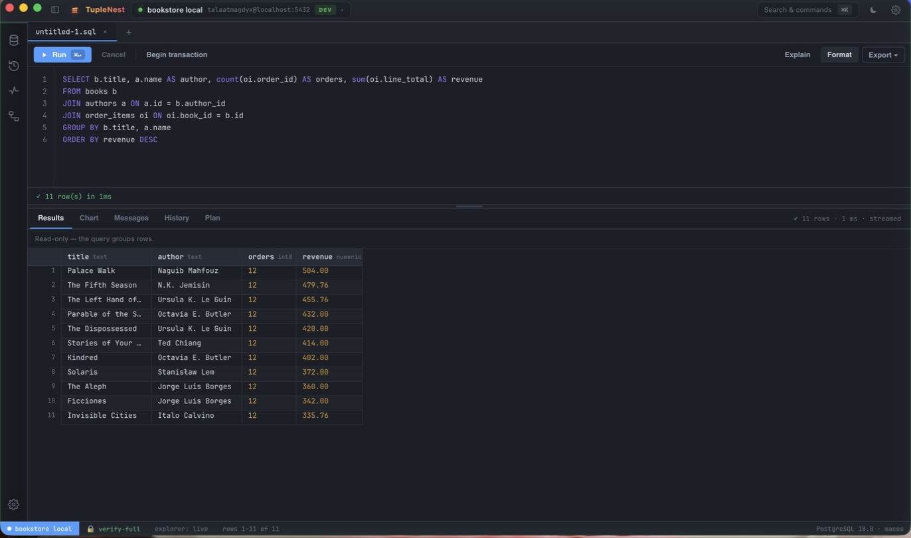
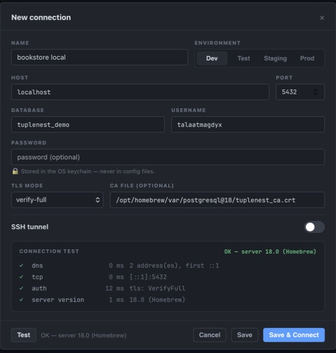
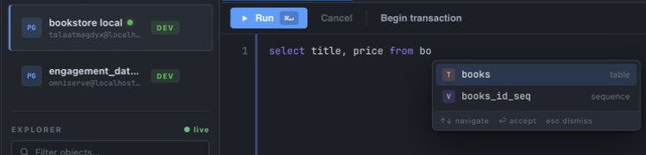
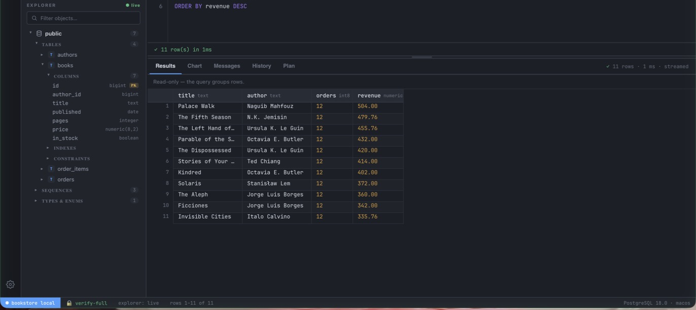
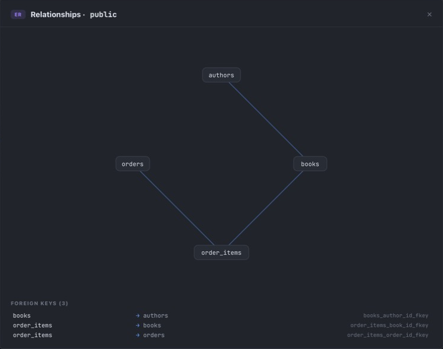
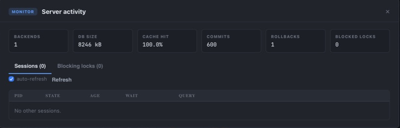

<p align="center">
  
</p>

<h1 align="center">TupleNest</h1>

<p align="center"><strong>The PostgreSQL IDE that asks before it writes.</strong></p>

<p align="center">
  Rust + Tauri 2 + React &nbsp;·&nbsp; macOS, Windows, Linux &nbsp;·&nbsp; MIT
</p>

<p align="center">
  <a href="https://github.com/talaatmagdyx/TupleNest/actions/workflows/ci.yml"></a>
  <a href="https://github.com/talaatmagdyx/TupleNest/actions/workflows/codeql.yml"></a>
  <a href="LICENSE"></a>
</p>

<p align="center">
  
</p>

TupleNest is a fast, local-first desktop workspace for exploring, developing,
debugging, and operating PostgreSQL. It is built around one conviction: **a
database tool's first job is to not hurt your database.** Every destructive
path in the app asks first, refuses politely, or is enforced by the server
itself — and every one of those guarantees has a test that would fail if it
stopped being true.

This release ships a complete PostgreSQL adapter; other engines are on the
roadmap.

> ⚠️ **Early software.** TupleNest is a v0.1.0 that has been tested far more
> than it has been *used*. The test suite is unusually serious for a first
> release — 1,600+ frontend tests, 34 contract tests against live PostgreSQL
> 13/15/17, SSH tunnel tests against a real sshd — but nobody has lived with it
> yet. Treat it accordingly, and file issues generously.

---

## What it feels like

**Connect without ceremony, but with proof.** A new connection runs a staged
probe — DNS, TCP, auth, server version — so when something is wrong you learn
*which layer* is wrong, not just "could not connect". TLS `verify-full` is the
default and fails closed; `verify-ca` exists for SSH tunnels, where the
certificate names the real host but you dial localhost.

<p align="center">
  
</p>

**Passwords go to the OS keychain — Keychain, Credential Manager, or Secret
Service — never to a config file, never over IPC, never into logs.** The form
says so, right under the field, because a promise you can't see is a promise
you can't check.

**Write SQL with a copilot that knows your schema.** Completion is
context-driven: tables after `FROM`, columns of the in-scope tables in
`WHERE`, `alias.` resolves to that table's columns. Comments and string
literals are masked first, so a table name inside a comment never poisons the
suggestions.

<p align="center">
  
</p>

**Watch results stream, not load.** The grid is virtualized and backpressured
— rows arrive in bounded batches, the first 100,000 are kept (with both a row
cap and a byte budget), and the footer tells you the truth about truncation.
A checksum test pins that nothing is lost or duplicated on the way. Unknown
column types are decoded from what the type *is*, never guessed from what the
bytes *look like* — a `money` value renders as money or as visibly-raw hex,
never as a plausible wrong number.

**Explore the schema like a filesystem.** Lazy tree of schemas → tables →
columns / indexes / constraints, with types and PK badges inline, backed by a
metadata cache that serves instantly and refreshes live.

<p align="center">
  
</p>

**See how the schema hangs together.** The ER view draws the foreign-key graph
and lists every constraint by name.

<p align="center">
  
</p>

**Operate, not just query.** Live server activity — backends, cache hit ratio,
commits/rollbacks, blocked locks, per-session state — with cancel and
terminate. Terminating a backend always asks; on prod it makes you type the
pid.

<p align="center">
  
</p>

---

## The safety model, in one table

| Layer | What it does | What enforces it |
| --- | --- | --- |
| **Read-only profiles** | Writes are refused | PostgreSQL itself (`SET SESSION CHARACTERISTICS … READ ONLY`) — not a client-side promise |
| **Destructive-statement guard** | `UPDATE`/`DELETE` without `WHERE`, `DROP`, `TRUNCATE`, `ALTER`, `GRANT`… ask before running on prod *and* staging | SQL is masked (comments, strings, dollar-quotes) before matching, so `-- where` can't disarm it. Best-effort by design — the seatbelt light, not the seatbelt |
| **Safe row editing** | Only single-table SELECTs with the full primary key are editable; joins, groups, CTEs, derived tables are refused with a reason | You review the exact generated `UPDATE`s before anything runs. Every statement is parameter-bound, keyed by the full PK, and guarded with `IS NOT DISTINCT FROM` on the old values — an edit racing another session affects 0 rows and is **refused**, not silently won |
| **Transactions** | One session serves all tabs, so the tab that opened a transaction owns it | Committing from another tab is refused and names the owner. Closing the window mid-transaction always prompts |
| **Auto-update** | Updates verified against a minisign key compiled into the binary | The release host only serves bytes; it never holds the key. Updating is refused while a transaction is open |
| **Generated/identity columns** | Read-only in the grid | Marked from `pg_catalog` (`attgenerated`/`attidentity`), not guessed from names |

Everything in that table has a test that executes the misuse and asserts the
refusal — including thirteen adversarial bypasses of the guard, the comma-join
editability hole, and the zero-row write.

## Everything else in the box

**Query work** — Format SQL · EXPLAIN / EXPLAIN ANALYZE plan tab · `$1..$n`
parameter binding · searchable history · a production audit log that keeps the
full SQL of everything run on prod · reusable snippets via the command palette
· CSV/JSON export with an honest truncation note.

**Schema work** — global object search · schema diff (column-by-column, types,
nullability, PKs) · find-usages and rename across tabs (whole-identifier,
unicode-aware) · EXPLAIN plan comparison with cost deltas and a "new
sequential scan" regression flag · partition tree browsing.

**Health** — index health report · vacuum & bloat panel · `pg_stat_statements`
top queries (when the extension is installed).

**Data in** — CSV import wizard: RFC-4180 parsing, type inference you review
before anything runs, batched inserts inside one transaction. The whole file
is read into memory, so very large CSVs are not yet practical.

**Fit and finish** — environment-reactive window frame (dev/staging/prod get
different ambient colors) · full keyboard navigation in the grid
(arrows/PageUp/Home/End, Enter to edit) with real `role="grid"` semantics ·
every modal is a real `role="dialog"` with a focus trap · respects
`prefers-reduced-motion` · dark, dense, flat — deliberately an IDE, not a
dashboard.

## Install

Every platform is built from the same source on its own CI runner.
[**Download the latest release**](../../releases/latest).

Because nothing is code-signed yet, **every OS will try to stop you at least
once.** That is expected, and each stop is spelled out below — including what
the error actually says, because the first two beta testers hit obstacles the
docs skipped past.

### macOS · `TupleNest_0.1.0_aarch64.dmg` (Apple Silicon) or the Intel `.dmg`

Requires macOS 10.15+.

1. Open the `.dmg`.
2. **Drag TupleNest.app onto the Applications shortcut inside it.** Opening the
   DMG does not install anything — this step is the install.
3. Eject the DMG, then launch from Applications (not from the DMG).
4. First launch: right-click TupleNest → **Open** → **Open**. Double-clicking
   shows "unidentified developer" with no way through; the right-click path is
   the only one that offers **Open**.

Or the whole thing in a terminal:

```sh
cp -R /Volumes/TupleNest/TupleNest.app /Applications/
xattr -dr com.apple.quarantine /Applications/TupleNest.app   # skips step 4
open -a TupleNest
```

<details>
<summary><b>"You can't open TupleNest because it is in the Trash"</b></summary>

The app is not really in the Trash — your **Dock or Launchpad icon still points
at an older copy that you moved there.** macOS reports a dangling icon this way,
which sounds like a state problem and is actually a stale alias.

Fix: drag the dead icon off the Dock, install from the DMG as above, and launch
from `/Applications` once. The Dock will re-attach to the new path.

This is also what you see if you never dragged the app out of the DMG at all —
the icon points at a volume that is no longer mounted.
</details>

<details>
<summary><b>"TupleNest is damaged and can't be opened"</b></summary>

Not damage — Gatekeeper's message for an unsigned app it has quarantined:

```sh
xattr -dr com.apple.quarantine /Applications/TupleNest.app
```

The quarantine flag is set by your browser on download, not by the app. Why it
is unsigned: notarization needs an Apple Developer account ($99/yr), which this
project does not have yet. The [attestation check](#verifying-a-download) is a
stronger guarantee than the dialog you are dismissing.
</details>

### Linux · `.AppImage` (recommended), `.deb`, or `.rpm`

Needs `webkit2gtk-4.1`; built on Ubuntu 22.04, so glibc 2.35+.

**The AppImage is the fast path** — no root, no package manager, no uninstall:

```sh
chmod +x TupleNest_0.1.0_amd64.AppImage
./TupleNest_0.1.0_amd64.AppImage
```

The `.deb`/`.rpm` integrate with your menus, at the cost of needing root:

```sh
sudo apt install ./TupleNest_0.1.0_amd64.deb     # Debian/Ubuntu
sudo dnf install ./TupleNest-0.1.0-1.x86_64.rpm  # Fedora/RHEL
```

> **Saved passwords need a keyring daemon** (GNOME Keyring, KWallet). A normal
> desktop has one; a minimal or server install may not. Without it, connecting
> works and *saving* a password fails. This is the one Linux behaviour with no
> automated coverage — [tell us](../../issues/new?template=bug_report.yml) if it
> bites you.

<details>
<summary><b>"Could not get lock /var/lib/dpkg/lock-frontend … held by process NNNN (unattended-upgr)"</b></summary>

Not a stale lock, and not TupleNest: `unattended-upgrades` is Ubuntu's automatic
security updater, and it holds the dpkg lock legitimately while it runs. Usually
1–5 minutes.

**Do not delete the lock file** — that is how you get a half-configured dpkg
database. Instead, use the AppImage (no dpkg involved), or wait:

```sh
sudo lsof /var/lib/dpkg/lock-frontend                        # who has it
sudo tail -f /var/log/unattended-upgrades/unattended-upgrades.log
```

If you must go now, stop it *gracefully* — never `kill -9`, which is what
actually corrupts things:

```sh
sudo systemctl stop unattended-upgrades
sudo apt install ./TupleNest_0.1.0_amd64.deb
sudo systemctl start unattended-upgrades
```
</details>

### Windows · `.exe` (NSIS) or `.msi`

Windows 10+. WebView2 installs automatically if missing.

The installer is unsigned, so SmartScreen shows **"Windows protected your PC"**
and **"Unknown publisher"**: click **More info** → **Run anyway**.

This one is not simply a funding problem, and it used to say it was. Apple's is:
pay, notarize, the warning stops. SmartScreen doesn't work that way. A standard
certificate makes the publisher name real but the warning stays until the
download builds reputation, so early users see it regardless. Only an EV
certificate skips that wait. Being unsigned makes this worse, not different —
and the wait resets whenever the signed file changes, which is every release.
[Verify the download instead](#verifying-a-download); it proves more than the
dialog does.

> Auto-update points at this repository's releases. A **draft** release is not
> `latest`, so the endpoint 404s and the app finds nothing until a release is
> actually published — the check fails silently by design and never nags. Until
> then, upgrading means downloading the next build by hand.

## Verifying a download

Every release carries a `SHA256SUMS` file. Check the installer you downloaded
is the one that was built:

```sh
shasum -a 256 -c SHA256SUMS --ignore-missing
```

**Be clear about what that proves.** `SHA256SUMS` is served from the same place
as the installer and is not signed, so it catches a truncated or corrupted
download — not a release host that has been tampered with. Anyone who could
swap the installer could swap the sums file beside it.

What does bind a file to the build that produced it is the **provenance
attestation**, which is signed by GitHub's OIDC identity rather than by
anything in the release:

```sh
gh attestation verify TupleNest_0.1.0_aarch64.dmg --repo talaatmagdyx/TupleNest
```

That says: this exact file came out of this repository's release workflow, at
this commit. It is the check worth running if you care.

CycloneDX SBOMs are attached to each release for anyone auditing dependencies:
`*.cdx.json`, one per Rust crate plus `frontend-sbom.cdx.json` for the npm
tree.

**Auto-updates are a separate mechanism and need nothing from you.** They are
signed offline with a minisign key and verified against a public key compiled
into the binary you already trust, so the release host only ever serves bytes —
it never holds the private key and cannot make the app accept an update.

## Supported PostgreSQL versions

**PostgreSQL 13 and newer.** Connecting to anything older is refused with a
reason rather than half-working: the schema explorer relies on catalog
functions (`pg_partition_tree`) that arrived in PostgreSQL 12, and 13 is the
oldest version the contract tests actually run against. CI exercises the full
suite against 13, 15 and 17 on every push.

## Build from source

```sh
cd apps/desktop
npm install --include=dev
npm run tauri build      # produces target/release/bundle/{macos,dmg}
```

Dev mode: `npm run tauri dev`.

> **`NODE_ENV` gotcha.** If your shell exports `NODE_ENV=production`, npm sets
> `omit=dev` and silently strips `vite`, `vitest`, and `typescript` — later
> installs then break the build. Always install with `--include=dev`. Do *not*
> "fix" that by exporting `NODE_ENV=development`: Vite reads it at build time and
> will bundle React's **development** build into the release (≈+400 kB and
> slower). Install with `--include=dev`; build with `NODE_ENV` left at
> production.

Run the test suites:

```sh
cargo test --workspace                  # Rust unit + integration
cd apps/desktop && npm test             # 1,600+ frontend tests
cargo test -p tuplenest-driver-postgres -- --include-ignored   # needs live PG
```

## Architecture

```
apps/desktop/       Tauri 2 shell — React/TypeScript frontend, Rust commands
crates/             Rust workspace: driver-api, driver-postgres, connection-core,
                    credential-store, ssh-core, workspace-store, metadata-cache,
                    result-stream, telemetry
docs/               plans, releasing runbook, this site
```

The frontend never sees a password and never builds SQL for writes by string
concatenation. The driver streams rows through a bounded channel with
backpressure; the credential store is an opaque-reference API over the OS
keychain; safety predicates (`needsGuard`, editability, masking) are pure
functions with adversarial test corpora.

More detail: [`SECURITY.md`](SECURITY.md) ·
[`PRIVACY.md`](PRIVACY.md) · [`CONTRIBUTING.md`](CONTRIBUTING.md) ·
[`CODE_OF_CONDUCT.md`](CODE_OF_CONDUCT.md) ·
[`docs/releasing.md`](docs/releasing.md) · [`CHANGELOG.md`](CHANGELOG.md) ·
[`THIRD-PARTY-NOTICES.md`](THIRD-PARTY-NOTICES.md)

## Feedback is the point

This is a beta because the questions that matter now cannot be answered by a
test suite: is the editor comfortable, are the shortcuts findable, does the
connection dialog make sense, does it break on your OS. So:

- 🐞 **[Something broke](../../issues/new?template=bug_report.yml)**
- 🤔 **[Nothing broke — it just felt wrong](../../issues/new?template=ux_feedback.yml)** ← the one that matters most
- 💬 **[Discussions](../../discussions)** for anything shaped like a conversation

## License

[MIT](LICENSE) © [Talaat Magdy](https://github.com/talaatmagdyx). One shipped
component is not MIT — see [`THIRD-PARTY-NOTICES.md`](THIRD-PARTY-NOTICES.md).

Built with amazing help from [Claude](https://claude.com). Design inspired by
VS Code.
